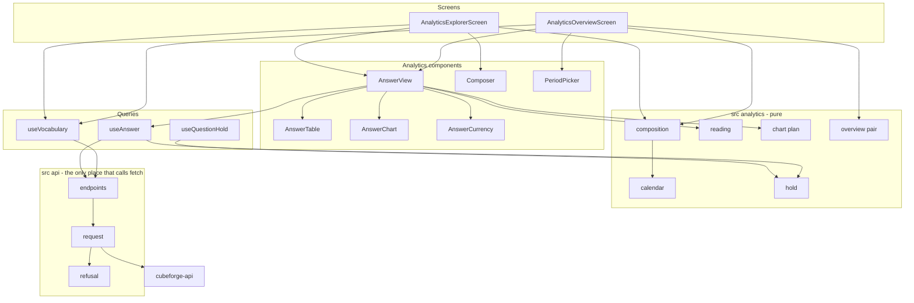
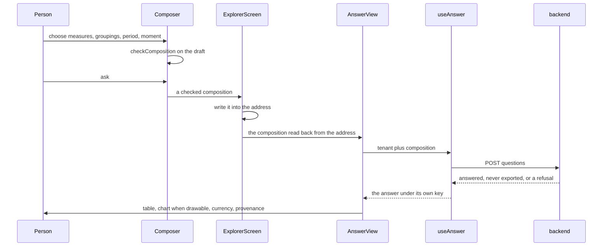
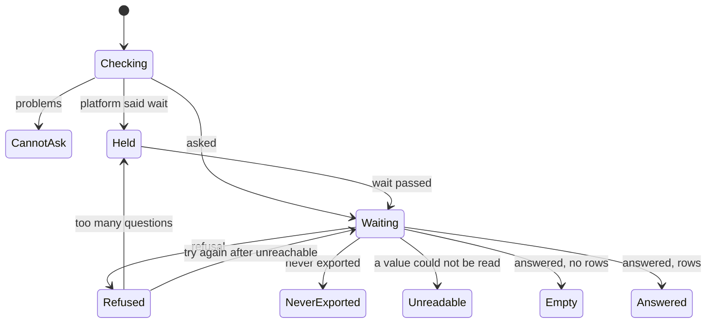

# Design — dashboard-analytics

## Overview

A person opens a tenant's analytics and sees two answers without composing
anything. Or they compose a question themselves, and the address remembers it.

The 47 criteria look like two screens' worth of behaviour. They are mostly one
thing said many ways: **a composition, checked against the platform's
vocabulary, asked once, and its answer rendered without adding a claim the
platform did not make.** The overview is two compositions chosen in advance.
The explorer is a composer and an address in front of the same machinery. The
rest of the requirements are the rules for rendering honestly: three states that
never collapse (5.x), the moment an answer is complete through (4.x), no figure
nobody returned (8.1), no chart that drops a row (3.7), and refusals that say
what to do (7.x).

Two things are new rather than assembled from the shell. The first is **a
vocabulary the platform does not yet publish.** The explorer must offer exactly
what the platform answers (3.2), and the platform is the only authority on that
(9.3). That takes a route in `cubeforge-api`. This design states the contract it
needs, and the route is specified and built there. The second is **a chart that
can decline to be drawn.** Whether an answer may be drawn at all is a rule this
feature owns, and the chart is built rather than adopted largely so the rule can
be tested against it (see `research.md`, section 4).

## Goals

- Every tenant role sees the analytics of the tenant they act in, and only that
  tenant's.
- An answer shown here is never read as more current, more complete or more
  certain than the platform said it was.
- Every refusal about a question tells the person what, if anything, to do.

## Non-Goals

- The step-7 movements route, changing data, triggering exports or rebuilds, and
  real-time figures (10.1–10.4).
- Saving, naming or sharing compositions beyond the address (3.8 is the whole of
  it).
- Choosing where `/` lands. It stays on members.

---

## Boundary Commitments

### This spec owns

- **Asking composed questions and rendering their answers** in two views, the
  overview and the explorer.
- **Deciding whether a composition can be asked**, whether it came from a
  person, an address or the overview's fixed pair.
- **Reading an answer's rows** into typed cells, and refusing an answer it
  cannot read rather than guessing.
- **Deciding whether an answer is drawn as a chart**, and drawing it.
- **The composition's place in the address.**
- **Holding questions** while the platform has said to wait.
- **Two additive changes to the shell's request layer.** `Retry-After` reaches
  the refusal, and a refused name becomes a refusal that blames nobody.
- **Offering the analytics in the navigation** to every tenant role, where the
  shell shows a disabled row marked "Soon".
- **Keeping the section when the tenant changes**, which the switcher does not
  do today.
- **Correcting the documents this feature makes stale**: frontend-shell's 10.3,
  the design brief's claim about the semantic layer, and the steering's layout.

### Out of boundary

- **The vocabulary route itself** — its handler, its admission and its content.
  Owned by a spec in `cubeforge-api`. This design proposes the shape below and
  consumes whatever that spec settles.
- **What any measure means, what any grouping is called, and how long a period
  may be.** The platform decides all three and states them through the
  vocabulary (9.3).
- **Who may ask.** The platform's guard decides. `analytics:read` hides nothing
  that protects anything (9.4).
- **When data is exported, and when a prepared answer is rebuilt** (9.5).
- **How many questions a minute a caller may ask.** The platform's allowance.
  This feature spends it carefully and reports it faithfully, and nothing more.
- **The shell's refusal policy for everything that is not analytics.** The two
  changes to `refusal.ts` are additive, and every existing kind keeps its words.

### Upstream prerequisite — the vocabulary route

```
GET /tenants/:tenantId/analytics/vocabulary   → 200 Vocabulary
```

Proposed shape, in the platform's current terms:

```json
{
  "measures": [
    { "name": "net_quantity", "cumulative": false },
    { "name": "movement_count", "cumulative": false },
    { "name": "on_hand_quantity", "cumulative": true }
  ],
  "groupings": [
    { "name": "recorded_day", "shape": "day", "column": "recorded_day" },
    { "name": "occurred_day", "shape": "day", "column": "occurred_day" },
    { "name": "kind", "shape": "category", "column": "kind" },
    { "name": "product", "shape": "labelled",
      "codeColumn": "product_code", "nameColumn": "product_name" },
    { "name": "location", "shape": "labelled",
      "codeColumn": "location_code", "nameColumn": "location_name" }
  ],
  "readBy": ["recorded", "occurred"],
  "longestPeriodDays": 366,
  "calendar": "UTC"
}
```

| Field | What this feature does with it | Requirement |
|---|---|---|
| `measures[].name`, `groupings[].name` | Offers them, and checks every composition against them | 3.2, 3.9, 9.3 |
| `measures[].cumulative` | Attaches the note that the figure counts movements from before the period | 2.4 |
| `groupings[].shape` and its columns | Reads each row's cells; labels products and locations by code and name | 3.5, 4.4 |
| `readBy` | Offers the moment to read by | 3.1 |
| `longestPeriodDays` | Refuses a longer period before asking, and names the limit | 3.4 |
| `calendar` | Today, the default period, and every day and moment shown | 2.5, 4.4 |

What the route is expected to share with the question route, stated so the API
spec can accept or reject each point explicitly:

- **Admission:** the same three roles, no machine credentials, and the wordless
  `404` otherwise.
- **Order:** the platform's preferred order, which the composer preserves.
- **Allowance:** not counted against the ten-questions-a-minute bucket. If it is
  counted, this design still holds, and each explorer showing costs one more.

**The row bound is deliberately absent.** The over-bound refusal names it, and
this feature renders that refusal as written (7.2).

### Allowed dependencies

The dependency direction is enforced by `src/architecture.test.ts`, which gains
one layer:

```
types → refusal → access → analytics → theme → session store → http → endpoints
      → session provider → queries → routing primitives → components → screens → route table
```

`src/analytics/` holds pure modules and one store. It depends on `types` alone:
it reads the vocabulary's and the answer's shapes and nothing that performs a
request.

- `src/api/**` is still the only place that calls `fetch` and the only place
  that reads a status **or a header**. `Retry-After` is read in `http.ts` and
  interpreted in `refusal.ts`.
- `RefusalNotice` is still the only component that turns a refusal into words.
  The wait and the refused name both travel as `Refusal` kinds so that this stays
  true.
- Only `src/analytics/composition.ts` decides whether a composition can be
  asked.
- Only `src/analytics/reading.ts` reads a row value.
- Only `src/analytics/chart-plan.ts` decides whether a chart is drawn.
- The only measure or grouping names written in application source are the two
  overview compositions, in `src/analytics/overview.ts`. A source scan holds
  that.
- No analytics module imports `useMutation` (10.2, 10.3).

### Revalidation triggers

- **The vocabulary route settles a shape other than the one proposed.** The
  endpoint, `types.ts` and `reading.ts` are revisited. Nothing above them should
  have to change.
- **A grouping shape other than `day`, `category` or `labelled` appears.**
  `reading.ts` and `chart-plan.ts` read the shape exhaustively, and a new one is a
  build failure by design.
- **Days stop being counted in one calendar for every tenant.**
- **The unknown-name or over-bound refusal changes its `field`**, or the
  over-bound refusal stops naming its limit.
- **`Retry-After` stops being sent in seconds, or the allowance becomes per
  tenant.** The hold is per caller because the bucket is.
- **The answer's three states change**, or `completeThrough` stops meaning
  "complete through".
- **On hand is measured to count movements after the period's end.** That is a
  defect upstream, and the overview's wording must not paper over it.
- **The allowance falls below what one overview showing costs**, which is two
  questions.

---

## Architecture



### Asking in the explorer



**The address holds what was asked, and the composer holds the draft.** Asking
is the one moment the draft becomes the composition. Writing every checkbox into
the address would spend a question per click, and the allowance is ten a minute.
Reading the answer from the address rather than from the composer is what makes
a reload and a shared link behave identically (3.8).

### What an answer view can show



`CannotAsk`, `Held` and `Waiting` never show a previous answer. There is no
placeholder data, on purpose: keeping the last answer on screen while the next
one loads is exactly what 1.2 forbids across tenants.

---

## Components & Interfaces

| Component | Layer | Intent | Requirements | Contracts |
|---|---|---|---|---|
| `types.ts` (extended) | types | The vocabulary, the question body and the answer | 9.1, 9.2 | State |
| `refusal.ts` (extended) | refusal | The wait, and a refused name that blames nobody | 7.1, 7.3, 7.5 | Service |
| `http.ts` (extended) | http | Hands `Retry-After` to `classify` | 7.3 | Service |
| `endpoints.ts` (extended) | endpoints | `fetchVocabulary`, `askQuestion` | 9.1, 10.1 | API |
| `permissions.ts` (extended) | access | `analytics:read` for every role | 1.1 | Service |
| `calendar.ts` | analytics | Days and moments in the platform's calendar | 2.5, 4.2, 4.4 | Service |
| `composition.ts` | analytics | Check, default, and write into and read from the address | 3.1–3.4, 3.8, 3.9 | Service |
| `overview.ts` | analytics | The overview's two compositions | 2.1–2.3 | State |
| `reading.ts` | analytics | Rows into typed cells, or unreadable | 3.5, 8.1 | Service |
| `chart-plan.ts` | analytics | Whether a chart is drawn, and its marks | 3.6, 3.7, 8.1 | Service |
| `hold.ts` | analytics | Questions held until the wait passes | 7.3 | State |
| `queries/analytics.ts` | queries | `useVocabulary`, `useAnswer`, `useQuestionHold` | 1.2, 1.3, 2.7, 6.1, 6.3, 7.3 | Service |
| `tenant-address.ts` | routing primitives | The same section in another tenant | 1.2 | Service |
| `AnswerView` | components | One composition, asked and rendered in every state | 4.x, 5.x, 6.1, 7.x | — |
| `AnswerTable`, `AnswerChart`, `AnswerCurrency`, `Composer`, `PeriodPicker`, `AnalyticsNav` | components | Presentation | see traceability | — |
| `SectionNav`, `TenantSwitcher` (changed) | components | Analytics offered; the section kept | 1.1, 1.2 | — |
| `AnalyticsOverviewScreen`, `AnalyticsExplorerScreen` | screens | The two views | 2.x, 3.x | — |
| `wording.ts` | analytics | Every sentence that is not a refusal | 2.4, 3.3, 3.4, 5.2, 5.3, 10.4 | Service |

### `src/api/types.ts` — the vocabulary, the question and the answer

```typescript
export interface VocabularyMeasure {
  readonly name: string;
  /** Counts movements recorded before the period as well as within it. */
  readonly cumulative: boolean;
}

export type VocabularyGrouping =
  | { readonly name: string; readonly shape: 'day'; readonly column: string }
  | { readonly name: string; readonly shape: 'category'; readonly column: string }
  | {
      readonly name: string;
      readonly shape: 'labelled';
      readonly codeColumn: string;
      readonly nameColumn: string;
    };

export interface Vocabulary {
  readonly measures: readonly VocabularyMeasure[];
  readonly groupings: readonly VocabularyGrouping[];
  readonly readBy: readonly string[];
  readonly longestPeriodDays: number;
  /** An IANA zone. Every day the platform counts is a day in this zone. */
  readonly calendar: string;
}

export interface QuestionBody {
  readonly measures: readonly string[];
  readonly groupings: readonly string[];
  readonly from: string;
  readonly to: string;
  readonly by: string;
}

export type RowValue = string | number | null;

export type ModelledAnswer =
  | {
      readonly state: 'answered';
      readonly completeThrough: string;
      readonly servedFrom: 'prepared' | 'exported-objects';
      readonly rows: readonly Readonly<Record<string, RowValue>>[];
    }
  | { readonly state: 'never-exported' };
```

Names are `string`, not literal unions. A union here would be the copy of the
vocabulary that this design exists not to keep. `shape` and `servedFrom` are
unions because the client must render each member differently, and a new one
must fail the build rather than render as something else.

### `src/api/refusal.ts` — two additions, and nothing existing reworded

```typescript
export type Refusal =
  | { readonly kind: 'rejected'; readonly message: string; readonly field?: string }
  | { readonly kind: 'unavailable' }
  /** `retryAfterSeconds` when the platform said how long; absent when it did not. */
  | { readonly kind: 'throttled'; readonly retryAfterSeconds?: number }
  | { readonly kind: 'unreachable' }
  | { readonly kind: 'session-ended' }
  /** The platform does not offer something the question named. Nobody's mistake. */
  | { readonly kind: 'not-offered' };

/** `retryAfter` is the raw `Retry-After` header, or `null` when absent. */
export function classify(status: number, body: unknown, retryAfter?: string | null): Refusal;
```

- **`throttled` with a wait** says how long, in whole seconds. Without one, it
  keeps the shell's sentence for the credential cooldown, which is correct there
  and unchanged. Only a positive integer of seconds is accepted. The HTTP-date
  form is ignored, because the platform does not send it and a clock comparison
  would be the second place in this client where a timer decides something.
- **`not-offered`** says the question could not be answered because it asked for
  something the platform does not offer, and that nothing the person did caused
  it (7.1). It is not `rejected`, so `RefusalNotice` renders it neutral rather
  than tinted and blamed. The refused names are not quoted back: they came from
  the dashboard, not from the person.
- `describeRefusal` stays exhaustive, and `RefusalNotice` still offers a retry
  for `unreachable` alone. A held question is asked again by the view when the
  wait passes, not by a button.

### `src/api/http.ts` — the header, handed on

Both `request` and `unauthorized` pass `response.headers.get('Retry-After')` to
`classify`. `request` still retries only the wordless refusal, so a throttled
question is never retried here (shell 3.4).

### `src/api/endpoints.ts` — two routes

```typescript
export function fetchVocabulary(tenantId: string): Promise<Vocabulary>;

/**
 * Throws `ApiError` as `request` does, with one reinterpretation. A `rejected`
 * refusal whose `field` is `question` (the answer would be too large) or
 * `period` passes through, because the platform's message is the right thing to
 * show. Any other `rejected` refusal — an unknown measure or grouping, or a body
 * the platform could not read — becomes `not-offered`: the dashboard composed
 * it, so the person cannot fix it.
 */
export function askQuestion(tenantId: string, body: QuestionBody): Promise<ModelledAnswer>;
```

No signal is passed. An abandoned answer is discarded by its key (1.3, 6.3), and
under StrictMode an abort would cancel and re-send, spending two questions of
ten. A source scan asserts that `endpoints.ts` names no `/analytics/movements`
route (10.1).

### `src/analytics/calendar.ts` — the platform's days

```typescript
/** `YYYY-MM-DD`, and a real date. */
export type Day = string & { readonly __day: unique symbol };

export function dayFrom(text: string): Day | null;
/** The current day in `calendar`, which is what "today" means for 2.5. */
export function today(calendar: string, now: Date): Day;
export function addDays(day: Day, days: number): Day;
/** Inclusive: a period from a day to itself is one day. */
export function spanInDays(from: Day, to: Day): number;
export function formatDay(day: Day): string;
/**
 * The moment, to the minute, in `calendar`, with the zone named. Truncated and
 * never rounded: rounding 14:59:40 up to 15:00 presents the answer as later
 * than the platform said (4.2).
 */
export function formatMoment(iso: string, calendar: string): string;
```

A `Day` is a calendar date with no time and no zone of its own. That is exactly
what the platform counts. It is formatted without ever being converted to the
viewer's zone, which is where a day silently becomes the day before (4.4).

### `src/analytics/composition.ts` — one check for every composition

```typescript
/** A composition as typed or read from an address: nothing checked yet. */
export interface Draft {
  readonly measures: readonly string[];
  readonly groupings: readonly string[];
  readonly from: string;
  readonly to: string;
  readonly by: string;
}

/** A composition the platform can be asked, in the vocabulary's order. */
export interface Composition {
  readonly measures: readonly string[];
  readonly groupings: readonly string[];
  readonly from: Day;
  readonly to: Day;
  readonly by: string;
}

export type CompositionProblem =
  | { readonly kind: 'no-measure' }
  | { readonly kind: 'not-offered'; readonly names: readonly string[] }
  | { readonly kind: 'not-a-day'; readonly which: 'from' | 'to'; readonly text: string }
  | { readonly kind: 'reversed' }
  | { readonly kind: 'too-long'; readonly longestDays: number }
  | { readonly kind: 'unknown-moment'; readonly text: string };

export type Checked =
  | { readonly ok: true; readonly composition: Composition }
  | { readonly ok: false; readonly problems: readonly CompositionProblem[] };

export function checkComposition(draft: Draft, vocabulary: Vocabulary): Checked;
/** The thirty days ending on the platform's today (2.5). */
export function defaultPeriod(vocabulary: Vocabulary, now: Date): { from: Day; to: Day };
export function draftFromAddress(search: URLSearchParams, vocabulary: Vocabulary, now: Date): Draft;
export function addressOf(composition: Composition): URLSearchParams;
export function questionBodyOf(composition: Composition): QuestionBody;
```

- **Every problem is reported, not the first.** A person who chose no measure and
  a reversed period should learn both at once. The platform reports every
  unknown name for the same reason.
- **An address part that is absent takes its default. An address part that is
  present and wrong is reported and never replaced (3.9).** A missing period
  means 2.5's thirty days, a missing moment means `recorded`, and missing
  groupings mean none. An unknown name or an unreadable day is a problem, and the
  view asks nothing.
- **Canonical order.** A checked composition lists measures and groupings in the
  vocabulary's order, duplicates removed. So two ways of writing the same
  question produce one address, one query key and one request.
- The address is `?measures=a,b&groupings=c&from=YYYY-MM-DD&to=YYYY-MM-DD&by=x`.
  The overview uses only `from` and `to`.

### `src/analytics/overview.ts` — the two questions asked in advance

```typescript
export interface FixedComposition {
  readonly measures: readonly string[];
  readonly groupings: readonly string[];
  readonly by: string;
}

/** On hand, per product (2.2). */
export const ON_HAND: FixedComposition;      // on_hand_quantity by product, read by recorded
/** Net quantity and count per recorded day, by kind (2.3). */
export const MOVEMENTS: FixedComposition;    // net_quantity, movement_count by recorded_day, kind
```

Each is joined to the overview's period and passed through `checkComposition`
like any other composition. If the platform stops offering a name, the view says
so before any question is spent.

### `src/analytics/reading.ts` — a row, read or refused

```typescript
export type Cell =
  | { readonly kind: 'measure'; readonly value: number | null }
  | { readonly kind: 'day'; readonly day: Day | null }
  | { readonly kind: 'category'; readonly text: string | null }
  | { readonly kind: 'labelled'; readonly code: string | null; readonly name: string | null };

export interface Column {
  readonly name: string;
  readonly role: 'grouping' | 'measure';
  readonly cumulative: boolean;
}

export interface AnswerTable {
  /** Groupings first, in the composition's order, then measures. */
  readonly columns: readonly Column[];
  /** Ordered by their grouping cells: days ascending, then text. */
  readonly rows: readonly (readonly Cell[])[];
}

export type Reading =
  | { readonly ok: true; readonly table: AnswerTable }
  | { readonly ok: false };

export function readAnswer(
  rows: readonly Readonly<Record<string, RowValue>>[],
  composition: Composition,
  vocabulary: Vocabulary,
): Reading;
```

- A measure is a number, or a string that is a finite decimal, or `null`.
  Anything else makes the answer **unreadable**. It does not make a zero.
  `Number('')` is `0`, and the platform already spells absence as `null` so that
  this never has to be guessed.
- A day is a value whose first ten characters are a real `YYYY-MM-DD`, or `null`.
- A row missing a column the composition implies makes the answer unreadable.
- `null` stays `null` all the way to the screen, where it renders as an absence
  and never as `0` (8.1).
- Rows are reordered, never altered. Ordering is not a figure.

### `src/analytics/chart-plan.ts` — drawn whole, or not at all

```typescript
export interface Mark {
  /** The row this mark draws. Every row appears exactly once per chart. */
  readonly row: number;
  readonly category: number;
  readonly series: number;
  readonly value: number;
}

export interface ChartPlan {
  readonly measure: string;
  readonly categories: readonly string[];
  readonly series: readonly string[];
  readonly marks: readonly Mark[];
  /** The only figures on the value axis: returned values, and zero. */
  readonly extremes: { readonly least: number; readonly greatest: number };
}

export type Charting =
  | { readonly drawn: true; readonly charts: readonly ChartPlan[] }
  | { readonly drawn: false };

export const MOST_CATEGORIES = 40;   // when the categories are not days
export const MOST_SERIES = 6;
export const MOST_MARKS = 400;       // per chart

export function planCharts(table: AnswerTable): Charting;
```

A chart is drawn **only if every row becomes exactly one mark in it**, and one
chart is drawn per measure, because a count and a quantity on one axis compare
things that do not compare. Otherwise the table stands alone (3.7):

| Groupings | Drawn as |
|---|---|
| none | not drawn: one row of totals is a table |
| one, of any shape | its values as categories, one series |
| one day and one other | days as categories, the other as series |
| two days, two non-days, or three or more | not drawn |

It is also **not drawn** when any of these holds:

- a grouping cell is absent, so the row has no place;
- a measure value is absent, so the mark would be missing;
- two rows share a position, so they would merge;
- a bound above is exceeded.

Days on the category axis are the days present in the rows, in order. A missing
day is not filled with zero, because a zero nobody returned is a derived figure
(8.1). Bars are grouped and never stacked, because a stack shows a total.

**The invariant a test holds:** for every drawn chart, `marks.length` equals the
number of rows, and every row index appears exactly once.

### `src/analytics/hold.ts` and `useQuestionHold` — waiting out the platform

```typescript
export function holdQuestions(seconds: number, now: number): void;
/** Whole seconds left, `0` when nothing is held. */
export function secondsHeld(now: number): number;
export function subscribe(listener: () => void): () => void;
/** Tests only: the hold outlives renders on purpose, so it has to be reset between tests. */
export function releaseHold(): void;
```

A module value, following the precedent of `session.ts`. The platform's
allowance is **per caller, across every tenant**, so the hold is too. Switching
tenant does not escape it, and it is not stored per query key.

`useQuestionHold()` returns the seconds left, re-rendering once a second while
held and not at all otherwise. `useAnswer` sets the hold when a question is
refused with a wait. It is disabled while the hold lasts, so no question leaves
the browser (7.3). When the hold passes, a view whose question was refused for
pace asks it once more.

### `src/queries/analytics.ts` — asking, once per showing

```typescript
export function useVocabulary(tenantId: string): UseQueryResult<Vocabulary, ApiError>;
export function useAnswer(
  tenantId: string,
  composition: Composition | null,
): UseQueryResult<ModelledAnswer, ApiError>;
export function useQuestionHold(): number;
```

| Setting | Vocabulary | Answer | Why |
|---|---|---|---|
| Key | `['vocabulary', tenantId]` | `['answer', tenantId, body]` | The tenant is in both. An answer for one tenant can never be read for another (1.2, 1.3) |
| `staleTime` | `Infinity` | `Infinity` | Nothing is asked again while its answer is on screen (2.7) |
| `gcTime` | default | `0` | Leaving the view discards the answer. Coming back is a new showing, which asks (2.7), and nothing about a previous tenant lingers in the cache |
| `refetchOnWindowFocus`, `refetchOnReconnect` | off | off | Focus is not a new showing |
| `enabled` | tenant present | composition present, and not held | A problem or a hold asks nothing (3.3, 3.4, 3.9, 7.3) |
| `placeholderData` | none | none | See the state diagram |

Keys are added to `keys.ts`, where every other key lives. Two views asking the
same composition share one request, because they share one key.

### `src/routes/tenant-address.ts` — the same place, somewhere else

```typescript
/** `/t/acme/analytics/explore?…` → `/t/globex/analytics/explore?…` */
export function sameSectionIn(tenantId: string, pathname: string, search: string): string;
```

`TenantSwitcher` links each row to this rather than to `/members`. The
composition travels with it, because nothing in a composition belongs to a
tenant. The new tenant's answer is asked under the new tenant's key (1.2).

### Presentation components — summary

All in `src/components/analytics/` except the two changed shell components.

- **`AnswerView`** `({ title, tenantId, vocabulary, checked })`. It asks
  through `useAnswer` and renders the state diagram above. The states:
  - problems, in `wording.ts`'s words;
  - held, as a `throttled` refusal carrying the seconds left, through
    `RefusalNotice`;
  - waiting, through the shell's `Waiting`;
  - refused, through `RefusalNotice`, with a retry for `unreachable`;
  - never exported: "has not arrived yet", with no table and no chart (5.3, 5.4);
  - unreadable: a statement that the answer could not be read, and nothing drawn;
  - empty: nothing recorded, with the currency (5.2);
  - answered: table, chart when drawn, currency, and the cumulative note for any
    such measure (2.4).
- **`AnswerTable`**. One `<table>`, the grouping headers naming the calendar for
  days, a product or location shown as its code and its current name, and an
  absent value rendered as an absence with an accessible name, never as `0`.
- **`AnswerChart`** `({ plan })`. SVG with one `<rect>` per mark, carrying the
  row it draws and a `<title>` stating the category, the series and the value.
  There is a zero baseline, and negative values go below it. The value axis is
  labelled only with the plan's extremes. It sits in its own `overflow-x: auto`
  container, so a year of days stays one bar per day on a phone.
- **`AnswerCurrency`** `({ completeThrough, servedFrom, calendar })`. It renders
  "complete through" and the moment, truncated to the minute with its zone named
  (4.1, 4.2, 4.4). Provenance follows it, in smaller, muted type, and is never a
  heading (4.3).
- **`Composer`** `({ vocabulary, initial, held, onAsk })`. It offers exactly the
  vocabulary's measures, groupings and moments, in its order and by its names
  (3.1, 3.2). It checks the draft on every change and shows its problems. Asking
  is disabled while there is a problem or a hold.
- **`PeriodPicker`** `({ vocabulary, initial, onChoose })`. Two days, checked
  with the same function (2.6).
- **`AnalyticsNav`**. Overview and Explore, as links that keep the tenant.
- **`SectionNav`** (changed). Analytics becomes a `NavLink` to
  `/t/:tenantId/analytics`, not `end`, so it stays current in the explorer. It
  is shown when `may(role, 'analytics:read')`. It takes the role, which
  `AppLayout` already holds.
- **`TenantSwitcher`** (changed). Rows link to `sameSectionIn(…)`.

### Screens

- **`AnalyticsOverviewScreen`**. Reads the period from the address, or 2.5's
  default. Joins it to `ON_HAND` and `MOVEMENTS`, and renders one `AnswerView`
  for each. A chosen period is written into the address (2.6).
- **`AnalyticsExplorerScreen`**. Reads the composition from the address with
  `draftFromAddress` and checks it. If it is wrong, it shows the problems and
  asks nothing (3.9). Otherwise it renders the `AnswerView`. Asking in the
  composer *pushes* a new address, so the back button returns to the previous
  composition.

### `src/analytics/wording.ts` — every sentence that is not a refusal

Pure functions, tested on their own:

- the problems;
- never exported;
- nothing recorded;
- the cumulative note;
- the provenance phrases;
- the unreadable statement.

It sits in `src/analytics/` rather than beside the screens, unlike
`members-wording.ts`. `AnswerView` and `Composer` are the ones that speak these
sentences, and a component may not import from `src/screens/`.

Two rules are held by tests:

- **Nothing recorded is never said for days the answer is not complete
  through.** When the period runs past `completeThrough`, the sentence covers
  the period only up to that day, and says that later data has not arrived.
  When the whole period is after it, the sentence says the data has not arrived.
  That is not a quiet period, and reading it as one is what 4.2 forbids.
- **No sentence claims currency the answer lacks.** A forbidden-vocabulary scan
  rejects "live", "real-time", "real time", "up to date" and "latest" (10.4).

### Routes

```
/t/:tenantId/analytics            the overview       ?from&to
/t/:tenantId/analytics/explore    the explorer       ?measures&groupings&from&to&by
```

Both sit inside `TenantRoute`, so an address naming a tenant the caller cannot
reach shows the shell's notice and asks nothing (3.10). A `404` from the
question route itself — the membership revoked since the standing was read —
shows the shell's "not available" through `RefusalNotice`. Both are the same
terms the shell uses for every refusal of that kind (1.4).

---

## Data Models

Nothing is persisted. The address is the only durable state this feature adds:

| Where | Contents | Lifetime | Why |
|---|---|---|---|
| Address, overview | `from`, `to` | The history entry | 2.6, and a reload keeps the period |
| Address, explorer | the asked composition | The history entry | 3.8 |
| Query cache | vocabulary, per tenant | The session | One request per tenant per session |
| Query cache | answers, per tenant and composition | While shown | 2.7 |
| `hold.ts` | the moment the wait ends | The page | 7.3 |

Sign-out already replaces the query cache, so no answer survives into another
person's session. The hold survives sign-out deliberately. It lasts at most a
minute, and the platform would refuse the next person's question the same way
if it came from the same caller.

---

## Error Handling

| Platform answer | Refusal | What the person sees | Where |
|---|---|---|---|
| `404` | `unavailable` | The shell's "not available", nothing more (1.4, 3.10) | `RefusalNotice` |
| `400`, `field: 'question'` | `rejected` | The platform's message, which names the limit and both remedies (7.2) | `RefusalNotice`, tinted |
| `400`, `field: 'period'` | `rejected` | The platform's message. Reachable only if the vocabulary and the route disagree | `RefusalNotice`, tinted |
| `400`, any other | `not-offered` | Could not be answered, and nothing the person did (7.1) | `RefusalNotice`, neutral |
| `429` with `Retry-After` | `throttled`, with seconds | How long to wait, counting down, with asking disabled (7.3) | `RefusalNotice` |
| `503`, or no answer | `unreachable` | Could not be answered now, with a retry. The layout and navigation stay usable (7.4) | `RefusalNotice`, inside the view |
| Refresh failed | `session-ended` | The shell's handling, unchanged | — |
| `200`, unreadable value | — | The answer could not be read, and nothing drawn | `AnswerView` |

**What never reaches the screen (7.5):** the `503` body's `reason`, any status,
any raw body, and any refused names. `classify` already keeps only `message` and
`field`, and `askQuestion` replaces the unknown-name message entirely. The
`field: 'question'` and `field: 'period'` messages are sentences the platform
wrote to be read. They name nothing belonging to anyone else.

---

## Testing Strategy

The platform is served by MSW handlers written from the contracts in
`research.md`. The question handler refuses unknown names with the platform's
exact body, and answers the overview's two compositions and a generic one from
fixtures shaped as the platform sends them: measures as decimal strings, days as
`YYYY-MM-DDT00:00:00.000`, absence as `null`. No test needs the API, Floci or
Cube.

**Unit — `refusal.ts`**
- A `429` with `Retry-After: 42` carries 42. Without the header, or with a date,
  zero or garbage, it carries nothing and keeps the credential sentence (7.3).
- `not-offered` is described without the vocabulary of blame. A scan rejects
  "you entered", "invalid", "incorrect" and "check your" (7.1).

**Unit — `endpoints.ts`**
- An unknown-name `400` surfaces as `not-offered`. `field: 'question'` and
  `field: 'period'` surface as `rejected`, with the platform's message (7.1,
  7.2).
- No source in `src/api` names `/analytics/movements` (10.1).

**Unit — `calendar.ts`**
- At 2026-09-10T01:00Z, today in UTC is the 10th, whatever the test machine's
  zone, and the default period is the 12th of August to the 10th of September
  (2.5, 4.4).
- 14:59:59 formats as 14:59, never 15:00 (4.2).

**Unit — `composition.ts`**
- Each problem on its own, and all at once. No measure (3.3). Reversed, too long,
  and naming the vocabulary's own longest period (3.4). An unknown name. An
  unreadable day.
- An address with parts absent takes the defaults. An address with a wrong part
  keeps it and reports it (3.9).
- The address round trip is exact (3.8). Two spellings of one question produce
  one address.

**Unit — `reading.ts`**
- `"6"` reads as 6. `null` stays `null`. `""`, `"six"` and `{}` make the answer
  unreadable, and **none of them becomes 0** (8.1).
- A product row is read as its code and its current name (3.5).

**Unit — `chart-plan.ts`**
- Every row in the grouping table above draws or does not, as stated (3.6, 3.7).
- An absent value, a repeated position and each bound exceeded all decline.
- **For every drawn plan in a generated set of tables, every row is exactly one
  mark.** This is 3.7, asserted as the invariant rather than per example.
- Days are not filled, and extremes are returned values (8.1).

**Unit — `wording.ts`**
- Never exported and nothing recorded are different sentences, and neither
  contains the other (5.3).
- A period running past `completeThrough` is not called quiet beyond it (4.2,
  5.2).
- The forbidden currency vocabulary (10.4).

**Component — `AnswerView`**
- Each state in the diagram, including never exported rendering no `table` and no
  `svg` element at all (5.4).
- The currency is beside every answered state, and provenance follows it in
  document order and is not a heading (4.1, 4.3).
- Waiting, then the answer, then nothing of the waiting (6.1).

**Component — `AnswerChart`**
- One `rect` per mark. Negative values sit below the baseline. The only numbers
  in the SVG are the extremes and zero (3.6, 8.1).

**Screen — overview**
- It shows both answers without any interaction (2.1, 2.2, 2.3).
- **Exactly two question requests per showing, counted.** Re-rendering,
  refocusing the window and choosing the same period again add none. Leaving and
  returning adds two (2.7).
- A chosen period reaches the address and both requests (2.6).
- The on-hand note is present whenever on hand is (2.4).

**Screen — explorer**
- The composer offers exactly the vocabulary's names, in its order (3.2). A
  handler serving a different vocabulary changes what is offered with no code
  change, which is the check that nothing is hard-coded.
- No measure and a bad period ask nothing. That is asserted by the request count,
  not by the absence of an answer (3.3, 3.4).
- Asking writes the address, and rendering that address fresh asks the same
  question (3.8). A wrong address asks nothing and reports it (3.9).
- Two compositions asked in quick succession, the first delayed: only the second
  answer is ever on screen (6.3).
- A wait is honoured with fake timers. No request is issued while held, and the
  view asks once when the wait passes (7.3).

**Routing — tenancy**
- Each role reaches the analytics, and `SectionNav` offers it to each (1.1).
- Switching tenant from the explorer lands on the other tenant's explorer with
  the same composition, and asks under the new tenant (1.2).
- **Tenant A's answer is delayed. The person switches to B. A's answer is then
  released. No figure or label from A's fixture is ever in the document** (1.3).
- A question answered `404` shows the shell's words (1.4). An unreachable tenant
  in the address asks nothing (3.10).
- With a question pending forever, switching tenant and signing out both work
  (6.2).
- A question answered `503` puts the notice inside the analytics view, with a
  retry. The tenant switcher, the navigation and the members screen go on
  working (7.4).

**Shell tests that change:**
- `served-addresses.test.tsx` gains the two addresses. `/dashboards` stays
  excluded.
- The three `AppLayout.test.tsx` tests holding "Soon" inert become tests that
  Analytics is a link for every role.
- `architecture.test.ts` gains the `analytics` layer.
- `refusals.test.tsx`'s scan still finds `describeRefusal` only in
  `RefusalNotice`.

**Scans:**
- No measure or grouping name appears in application source outside
  `overview.ts` (9.3).
- No analytics module imports `useMutation` (10.2, 10.3).

**Verification by breaking.** Every test above is shown to fail when what it
guards is removed:
- the tenant taken out of the answer key (1.2, 1.3);
- `gcTime` restored to the default (2.7);
- the hold bypassed (7.3);
- a missing day filled with zero (8.1);
- a row dropped from a plan (3.7).

---

## File Structure Plan

### Created

| Path | Responsibility |
|---|---|
| `src/analytics/calendar.ts` | `Day`, today, spans, day and moment formatting |
| `src/analytics/calendar.test.ts` | The platform's today, truncation |
| `src/analytics/composition.ts` | `checkComposition`, defaults, the address codec, the question body |
| `src/analytics/composition.test.ts` | Every problem, defaults, round trip, canonical order |
| `src/analytics/overview.ts` | `ON_HAND`, `MOVEMENTS` |
| `src/analytics/overview.test.ts` | Both pass the check against the fixture vocabulary. No names elsewhere in source |
| `src/analytics/reading.ts` | `readAnswer` |
| `src/analytics/reading.test.ts` | Strict numbers, days, labels, unreadable |
| `src/analytics/chart-plan.ts` | `planCharts` and its bounds |
| `src/analytics/chart-plan.test.ts` | The rules, and the one-mark-per-row invariant |
| `src/analytics/hold.ts` | The per-caller hold |
| `src/analytics/hold.test.ts` | Holding, counting down, releasing |
| `src/queries/analytics.ts` | `useVocabulary`, `useAnswer`, `useQuestionHold` |
| `src/routes/tenant-address.ts` | `sameSectionIn` |
| `src/routes/analytics-tenancy.test.tsx` | 1.1–1.4, 3.10, 6.2 |
| `src/components/analytics/AnswerView.tsx` | One composition, every state |
| `src/components/analytics/AnswerView.test.tsx` | The states, currency, provenance |
| `src/components/analytics/AnswerTable.tsx` | The rows as a table |
| `src/components/analytics/AnswerChart.tsx` | One plan as SVG |
| `src/components/analytics/AnswerChart.test.tsx` | Marks, baseline, axis figures |
| `src/components/analytics/AnswerCurrency.tsx` | Complete through, calendar, provenance |
| `src/components/analytics/Composer.tsx` | The draft, offered from the vocabulary |
| `src/components/analytics/PeriodPicker.tsx` | Two days, checked |
| `src/components/analytics/AnalyticsNav.tsx` | Overview and Explore |
| `src/screens/AnalyticsOverviewScreen.tsx` | The overview |
| `src/screens/AnalyticsOverviewScreen.test.tsx` | 2.1–2.7 |
| `src/screens/AnalyticsExplorerScreen.tsx` | The explorer |
| `src/screens/AnalyticsExplorerScreen.test.tsx` | 3.1–3.9, 6.3, 7.3 |
| `src/analytics/wording.ts` | Every sentence that is not a refusal |
| `src/analytics/wording.test.ts` | Distinct states, the currency rule, forbidden vocabulary |

### Modified

| Path | Change |
|---|---|
| `src/api/types.ts` | `Vocabulary`, `QuestionBody`, `ModelledAnswer` |
| `src/api/refusal.ts`, `refusal.test.ts` | The wait on `throttled`, `not-offered`, and their words |
| `src/api/http.ts`, `http.test.ts` | `Retry-After` handed to `classify`; a throttled question not retried |
| `src/api/endpoints.ts`, `endpoints.test.ts` | `fetchVocabulary`, `askQuestion` and its reinterpretation; no movements route |
| `src/access/permissions.ts`, `permissions.test.ts` | `analytics:read` for every role |
| `src/queries/keys.ts` | `vocabulary`, `answer` |
| `src/routes/AppRoutes.tsx` | The two addresses, inside `TenantRoute` |
| `src/routes/served-addresses.test.tsx` | The two addresses committed to |
| `src/components/SectionNav.tsx` | Analytics as a link, gated by `may` |
| `src/components/AppLayout.tsx` | Passes the role to `SectionNav` |
| `src/components/AppLayout.test.tsx` | The analytics row, now a link for every role |
| `src/components/TenantSwitcher.tsx` | Rows keep the section |
| `src/architecture.test.ts` | The `analytics` layer |
| `test/handlers.ts` | The vocabulary and question routes, fixtures, and `paced` and `unanswerable` refusal builders |
| `test/setup.ts` | Releases the hold between tests |
| `test/journey.test.tsx` | Sign in, the overview, the explorer, another tenant |
| `.kiro/specs/frontend-shell/design.md` | 10.3 marked superseded by this feature |
| `.kiro/design-brief.md` | The stale claim that the semantic layer has no models |
| `.kiro/steering/structure.md` | The directories this feature adds, and the stale "no feature specified yet" |
| `.kiro/steering/product.md` | The two analytics routes in "How a caller reaches the platform" |

No dependency is added.

---

## Requirements Traceability

| Requirement | Summary | Components | Flows |
|---|---|---|---|
| 1.1 | Every tenant role reaches analytics | `permissions.ts` `analytics:read`, `SectionNav`, `AppRoutes` | — |
| 1.2 | Switching shows only the new tenant | `sameSectionIn`, `TenantSwitcher`, tenant in every key, no placeholder data | State |
| 1.3 | A late answer is discarded | Answer key carries the tenant; `gcTime: 0` | State |
| 1.4 | Refused for the person: not available | `unavailable` → `RefusalNotice` in `AnswerView` | — |
| 2.1 | Overview without composing | `AnalyticsOverviewScreen`, `overview.ts` | — |
| 2.2 | On hand per product, code and name | `ON_HAND`, `reading.ts` labelled cells, `AnswerTable` | — |
| 2.3 | Net quantity and count per day by kind | `MOVEMENTS`, `chart-plan.ts` day and series | — |
| 2.4 | On hand counts before the period | `cumulative` from the vocabulary, cumulative note in `wording.ts` | — |
| 2.5 | Thirty days ending today | `defaultPeriod`, `calendar.today` in the platform's calendar | — |
| 2.6 | Another period | `PeriodPicker`, address `from` and `to` | — |
| 2.7 | Asked once per showing | `staleTime: Infinity`, `gcTime: 0`, no focus refetch; request count test | — |
| 3.1 | Compose measures, groupings, period, moment | `Composer`, `Draft` | Sequence |
| 3.2 | Exactly the platform's vocabulary | `useVocabulary`, `Composer`, upstream route | Sequence |
| 3.3 | No measure: not asked | `checkComposition` `no-measure`, `enabled` | State |
| 3.4 | Bad period: not asked, limit named | `checkComposition` `reversed`, `too-long` with `longestPeriodDays` | State |
| 3.5 | Always a table, code and name | `AnswerTable`, `reading.ts` | — |
| 3.6 | A chart when every row fits | `planCharts`, `AnswerChart` | — |
| 3.7 | Otherwise table alone | `planCharts` declines; one-mark-per-row invariant | — |
| 3.8 | Composition in the address | `addressOf`, `draftFromAddress`, push on ask | Sequence |
| 3.9 | A wrong address is reported | `draftFromAddress` keeps wrong parts; `CannotAsk` | State |
| 3.10 | Unreachable tenant in the address | `TenantRoute` before any question | — |
| 4.1 | Complete-through beside every answer | `AnswerCurrency` | — |
| 4.2 | Never more current than reported | `formatMoment` truncates; nothing-recorded sentence bounded by `completeThrough` | — |
| 4.3 | Provenance, less prominent | `AnswerCurrency`, after currency, muted | — |
| 4.4 | Days in the platform's calendar, named | `Day`, `formatDay`, `calendar` from the vocabulary, headers name it | — |
| 5.1 | Rows shown | `AnswerView` answered state | State |
| 5.2 | No rows: nothing recorded, with currency | `AnswerView` empty state, `wording.ts` | State |
| 5.3 | Never exported: not arrived, distinct | `ModelledAnswer` union; never-exported sentence | State |
| 5.4 | No empty chart or table for never exported | `AnswerView` renders neither | State |
| 6.1 | Waiting shown | `Waiting` in `AnswerView` | State |
| 6.2 | The rest stays usable | Queries are asynchronous; the layout sits outside the view | — |
| 6.3 | Latest composition wins | Key per composition, no placeholder data | Sequence |
| 7.1 | Unknown name: not the person's fault | `askQuestion` → `not-offered`, neutral `RefusalNotice` | — |
| 7.2 | Too large: limit named, narrowing suggested | `rejected` with the platform's message | — |
| 7.3 | Too quick: how long, and hold | `Retry-After` → `throttled`, `hold.ts`, `useQuestionHold`, `enabled` | State |
| 7.4 | Unavailable: said in the view; rest usable | `unreachable` in `AnswerView` with retry | State |
| 7.5 | No unintended detail | `classify` keeps prose only; `not-offered` quotes nothing | — |
| 8.1 | No derived figures | `reading.ts` keeps `null`; `chart-plan.ts` no fill, no stack; extremes only; no totals row | — |
| 9.1 | Depends on the platform to answer | `askQuestion`, `ModelledAnswer` | Sequence |
| 9.2 | Depends on the platform for never exported | `state` read directly; no inference from empty rows | — |
| 9.3 | The platform is the only authority on names | Vocabulary route; names scan outside `overview.ts` | — |
| 9.4 | Who sees is the platform's decision | `analytics:read` protects nothing; `404` handled | — |
| 9.5 | Export and rebuild outside its control | No control, no endpoint | — |
| 10.1 | Only composed questions | `endpoints.ts` has no movements route; scan | — |
| 10.2 | No way to change data | No analytics mutation; `useMutation` scan | — |
| 10.3 | No way to trigger export or rebuild | Same scan; no such endpoint | — |
| 10.4 | No figure as real-time | Currency on every answer; forbidden vocabulary | — |

---

## Open Questions

- **The vocabulary route's final shape** belongs to the API spec. This design's
  proposal is its input, and any difference is a revalidation trigger (above).
- **On hand after the period's end** should be measured against the running
  stack before the overview's evidence is taken. The wording holds either way,
  but the model might not.
- **The chartability bounds** (40 categories, 6 series, 400 marks) are first
  guesses at legibility. They are tuned against real answers in the tasks, not
  argued about here.
- **Frontend-shell's 10.3 is superseded.** Its design is annotated rather than
  its requirements rewritten, because those requirements were approved and
  implemented as they stood.
