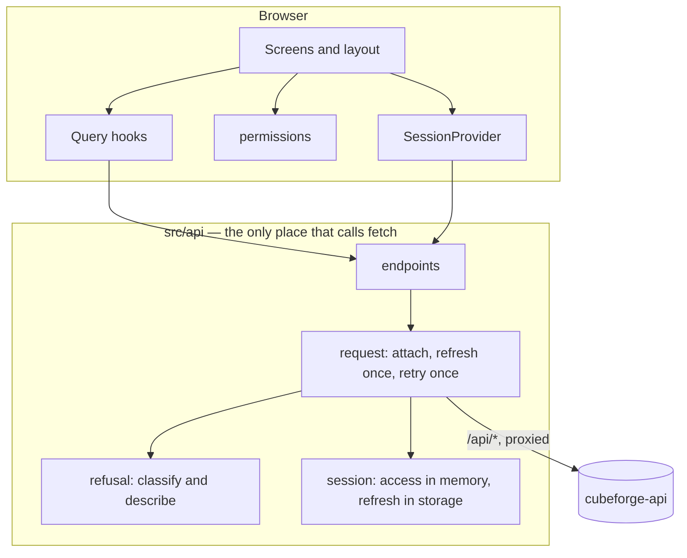
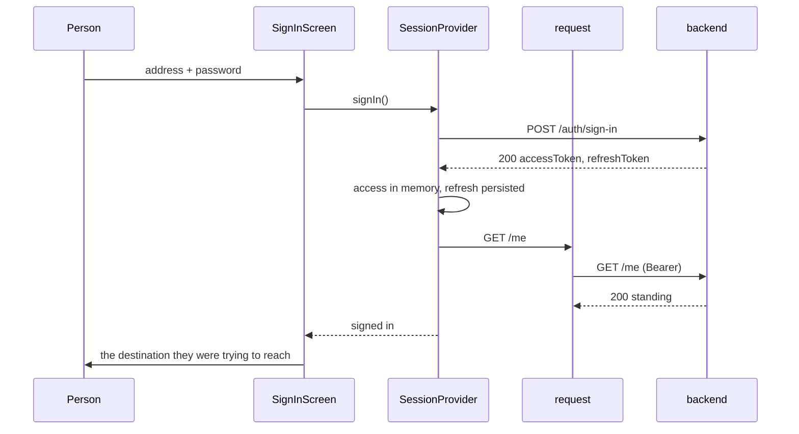
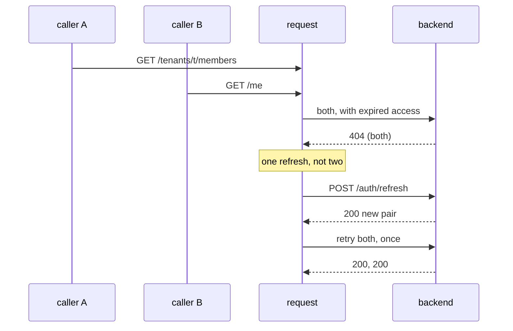

# Design — frontend-shell

## Overview

A person signs in, the application asks the backend who they are, and everything
after that follows from the answer.

The feature is small in surface — two screens and a layout — and the interesting
part is not either screen. It is that four separate requirements (1.2, 7.6, 8.1,
8.3) are the same question wearing different clothes: *what kind of answer was
that?* This backend gives three kinds, and one of them carries no reason at all
by deliberate design. A client that classifies once and renders many times gets
that right everywhere; a client that inspects a status code at each call site
gets it right until the seventh call site.

The same collapse happens twice more. Requirements 3.1–3.4 are one capability,
not four: attaching access, refreshing it, holding concurrent callers and
declining to retry are the same function's business, and nothing above it should
know that access expires. Requirements 6.1, 6.2, 7.3 and 7.4 are one predicate:
*may this role do this here.* Consulted by the navigation and by the screen, so
a control cannot be hidden in one and left enabled in the other.

Everything else is ordinary React. `research.md` records what was rejected.

---

## Boundary Commitments

### This spec owns

- **The session as the browser experiences it**: establishing it, persisting
  enough of it to survive a reload, refreshing access, and ending it.
- **Classifying every backend answer** into one closed union, and being the only
  place that turns that union into words a person reads.
- **The caller's standing as client-side state**: when it is fetched, when it is
  refetched, and when it is discarded.
- **Which tenant is selected**, and what happens when the selection is no longer
  reachable.
- **What the navigation offers**, given a role.
- **Two screens**: signing in, and the members of the selected tenant.

### Out of boundary

- **Authorization.** Enforced by `cubeforge-api`. Nothing hidden, disabled or
  omitted here is relied upon as protection (requirement 9.1). The consequence
  is concrete: the mutation paths must handle a refusal from a route whose
  control the caller could see.
- **Deciding which tenants a caller may reach.** `GET /me` already returns only
  those that currently grant access; this feature does not filter that list, and
  adding a filter would mean two answers to one question (9.3).
- **Withholding email addresses.** The backend omits the field for a caller who
  is not an administrator. The client renders what it received; it does not
  decide who may see an address (9.1).
- **Metric definitions, charts, analytical queries** — `dashboard-frontend`.
- **Platform-operator screens and API-key screens** (10.1, 10.2).
- **Setting a password from a setup token** (10.4). A person arrives able to
  sign in.
- **Visual design** beyond a plain readable layout.

### Allowed dependencies

The dependency direction is a rule, not a preference. Each module imports only
from those to its left.

```
types → refusal → access → session → http → endpoints → queries → routing → screens → components
```

- `src/api/**` is the only place that may call `fetch`, and ESLint already
  enforces it. Everything else imports functions, never URLs.
- Nothing outside `src/api/session.ts` reads or writes a token.
- Nothing outside `src/api/refusal.ts` inspects a status code.
- Nothing outside `src/access/permissions.ts` decides what a role may do.
- Screens depend on queries; queries never depend on screens.

### Revalidation triggers

Any of these invalidates part of this design and requires revisiting it:

- The backend stops making authorization refusals indistinguishable from absence
  (9.4). Half of `refusal.ts` exists only because it does.
- The access-token lifetime changes materially from 900 seconds, or refresh
  tokens stop rotating.
- `GET /me` starts returning tenants the caller cannot reach, which would move
  filtering into this repository.
- The members listing starts sending `email: null` rather than omitting it,
  which would erase the distinction requirement 7.2 depends on.
- Platform-operator screens are added, which would give `isOperator` a
  destination and change the navigation from a fact into a branch.

---

## Architecture



### Signing in, and the first read



### Access expiring mid-session



If the refresh fails, `request` throws `{ kind: 'session-ended' }`, the provider
ends the session, and the router shows the sign-in screen (3.2).

**The refresh call is issued outside the authorized path.** It carries no access
token and can never itself trigger a refresh, which is what keeps 3.1 from
recursing.

---

## Components & Interfaces

### `src/api/types.ts` — the backend's shapes

```typescript
export type Role = 'admin' | 'editor' | 'viewer';

export interface Session {
  readonly accessToken: string;
  readonly refreshToken: string;
  readonly sessionExpiresAt: string;
}

export interface TenantMembership {
  readonly tenantId: string;
  readonly tenantName: string;
  readonly role: Role;
}

export interface CallerStanding {
  readonly personId: string;
  readonly email: string;
  readonly isOperator: boolean;
  readonly memberships: readonly TenantMembership[];
}

/**
 * `email` is optional because the backend *omits* it for a caller who is not an
 * administrator of this tenant — it does not send `null`. The distinction is
 * load-bearing: absent means withheld, and requirement 7.2 forbids rendering a
 * blank that a person could read as missing data.
 */
export interface Member {
  readonly membershipId: string;
  readonly personId: string;
  readonly email?: string;
  readonly role: Role;
  readonly active: boolean;
}
```

### `src/api/refusal.ts` — one classification, one vocabulary

```typescript
export type Refusal =
  /** 400 or 409: the backend named a cause meant to be shown. */
  | { readonly kind: 'rejected'; readonly message: string; readonly field?: string }
  /** 404: refused or absent, indistinguishable by design. No cause exists. */
  | { readonly kind: 'unavailable' }
  /** 429 on a credential endpoint. */
  | { readonly kind: 'throttled' }
  /** The request never got an answer. */
  | { readonly kind: 'unreachable' }
  /** Access expired and could not be renewed. */
  | { readonly kind: 'session-ended' };

export class ApiError extends Error {
  readonly refusal: Refusal;
  constructor(refusal: Refusal);
}

/** The only function in the application that reads a status code. */
export function classify(status: number, body: unknown): Refusal;

/**
 * The only function that turns a refusal into words.
 *
 * For `unavailable` it says that the thing is not available and stops. It must
 * never say the session expired, that permission is missing, or that a record
 * does not exist: the backend answers all three identically so that one
 * customer cannot confirm another's records, and a guess here would be wrong
 * most of the time while sounding authoritative (8.1).
 */
export function describeRefusal(refusal: Refusal): string;
```

### `src/api/session.ts` — where the credential lives

```typescript
/**
 * The access token stays in memory and the refresh token is persisted, so a
 * reload recovers the session while the shorter-lived credential is never
 * written anywhere.
 *
 * Persisting the refresh token means any injected script can read it. That is
 * accepted rather than solved: a static SPA served from S3 cannot be given an
 * `httpOnly` cookie by an API on another origin, and the alternative — signing
 * a person out on every reload — was rejected as a product decision. Rotation
 * on the backend bounds how long a stolen token is worth having.
 */
export const REFRESH_STORAGE_KEY = 'cubeforge.refresh';

export interface SessionState {
  accessToken(): string | null;
  refreshToken(): string | null;
  adopt(session: Session): void;
  end(): void;
}

export const session: SessionState;
```

A module value rather than React state on purpose: `request` needs the current
token, and a token read through a closure is a token that can be one render
stale — precisely during the refresh this design is built around.

### `src/api/http.ts` — the authorized request

```typescript
export interface RequestOptions {
  readonly method?: 'GET' | 'POST' | 'PATCH' | 'DELETE';
  readonly body?: unknown;
  readonly signal?: AbortSignal;
}

/**
 * Attaches access, and on a refusal that could be expiry, refreshes once and
 * retries once. Throws `ApiError` for everything else. Resolves to `void` for a
 * `204`.
 *
 * A single module-scoped promise serializes refreshing, so several requests
 * that expire together produce one refresh and one outcome (3.3).
 */
export function request<T>(path: string, options?: RequestOptions): Promise<T>;
```

**The one unpleasant consequence of the backend's non-disclosure.** An expired
token and a genuine refusal are both `404`, and nothing in the response tells
them apart. `request` therefore attempts the refresh-and-retry whenever it holds
a session and receives `404`, and reports `unavailable` only if the retry
answers `404` too. Both alternative readings are worse: never refreshing signs
people out every fifteen minutes, and treating `404` as expiry signs them out on
every legitimate refusal.

**A request whose credential was renewed underneath it just retries.** If the
access token in hand differs from the one the attempt presented, somebody else
found the expiry first and renewed while this request was in flight. Retrying
with the new credential and renewing nothing is the only correct reading —
found during task 3.2's review, where the cooldown would otherwise have
reported `unavailable` to a request that was merely unlucky with its timing.

**Access that was just renewed is not renewed again.** Without this, a screen
holding several genuinely refused resources rotates the refresh token once per
resource — each `404` looks exactly like expiry to a layer that cannot see the
others. `request` therefore skips the refresh when the current access was
obtained within the last few seconds, and reports `unavailable` directly. The
window is a heuristic and is allowed to be: being wrong makes one request report
`unavailable` that a refresh would have rescued, and the next request refreshes
anyway. It is the only place in this design where a timer decides anything, and
it is a cost control rather than a correctness mechanism.

### `src/api/endpoints.ts` — the contract, once

```typescript
export function signIn(credentials: { email: string; password: string }): Promise<Session>;
export function refresh(refreshToken: string): Promise<Session>;
export function signOut(refreshToken: string): Promise<void>;
export function fetchStanding(): Promise<CallerStanding>;
export function listMembers(tenantId: string): Promise<readonly Member[]>;  // ?includeInactive=true
export function inviteMember(tenantId: string, invitation: { email: string; role: Role }): Promise<void>;
export function changeMemberRole(tenantId: string, membershipId: string, role: Role): Promise<void>;
export function revokeMembership(tenantId: string, membershipId: string): Promise<void>;
```

`signIn`, `refresh` and `signOut` bypass the authorized path through
`unauthorized`, exported from `http.ts`: it has no credential to attach and no
retry to reach, so "the renewal cannot renew itself" is a property of the
function rather than a rule three callers have to keep. `http.ts` uses it for
its own renewal, which is why that module names a route without duplicating the
request.

`listMembers` always asks for revoked memberships. The backend leaves them out
unless asked, and requirement 7.1 asks the listing to report whether a
membership is active — without the query that column would read `true` on every
row it ever rendered.

A failed renewal ends the session, **except** when the backend could not be
reached: a dropped connection says nothing about the credential, and signing
somebody out over it would cost them a password for a tunnel.

### `src/access/permissions.ts` — may this role do this here

```typescript
export type Permission =
  | 'members:read'
  | 'members:invite'
  | 'members:change-role'
  | 'members:revoke';

export type RoleAdmission = Readonly<Record<Permission, readonly Role[]>>;

export function may(role: Role, permission: Permission): boolean;
```

A table, not a chain of comparisons, and the only place a role is turned into a
capability. Depends on `types` alone, which is why the navigation and the
screens can both consult it without either importing the other.

### `src/session/SessionProvider.tsx` — the session as React sees it

```typescript
export type SessionStatus =
  /** A stored session is being exchanged; show neither form nor app (2.2). */
  | { readonly state: 'restoring' }
  | { readonly state: 'signed-out' }
  | { readonly state: 'signed-in' };

export interface SessionContextValue {
  readonly status: SessionStatus;
  readonly signIn: (credentials: { email: string; password: string }) => Promise<void>;
  /** Never rejects. */
  readonly signOut: () => Promise<void>;
}

export function useSession(): SessionContextValue;
```

On sign-out it ends the session *and* clears the Query cache, so the next person
to sign in on this browser cannot be shown the previous one's data (4.4) — and
on sign-in too, because a session can end without anyone signing out and leave
the cache behind.

Signing out never rejects. The backend is told, its refusal is swallowed, and
the credential, the stored token and the cache go regardless: leaving somebody
signed in because the network dropped is the one outcome this must not produce.

The initial state is decided while rendering rather than in an effect — a
`signed-out` corrected a moment later is the flash 2.2 forbids — and the
exchange runs once per page, guarded against StrictMode's double invocation,
because a second exchange of a rotating refresh token would end the session the
first restored. A stored credential the backend *never answered about* is kept
rather than discarded: 2.3 is about one it declines to exchange.

`useSession` lives in its own module: a file exporting a component may export
nothing else without breaking fast refresh.

### `src/queries/*` — server state

```typescript
export function useStanding(): UseQueryResult<CallerStanding, ApiError>;
export function useMembers(tenantId: string): UseQueryResult<readonly Member[], ApiError>;
export function useInviteMember(tenantId: string): UseMutationResult<void, ApiError, { email: string; role: Role }>;
export function useChangeMemberRole(tenantId: string): UseMutationResult<void, ApiError, { membershipId: string; role: Role }>;
export function useRevokeMembership(tenantId: string): UseMutationResult<void, ApiError, { membershipId: string }>;
```

Retries are off at the Query level. The single retry this design allows belongs
to `request`, which is the only layer that knows *why* it is retrying (3.4).

`useStanding` is switched off until the session is established — not merely
until a stored token exists. A read fired during the restore carries no access
token, is answered with the wordless `404`, and sends the request layer off to
renew a credential the provider is already exchanging; two exchanges of one
rotating refresh token invalidate the family, so the read would end the session
it was reading for. It is held current once obtained (`staleTime: Infinity`),
because who the caller is changes only when somebody changes it, and the two
ways to do that from here invalidate the key themselves (4.5).

Every mutation invalidates the members list (7.5). The two that can change the
caller's own standing — changing a role, revoking a membership — also invalidate
the standing (4.5).

### `src/routes/*` — where the selection lives

```
/sign-in                      the form
/                             → the only tenant, the remembered one, or /no-tenants
/t/:tenantId/members          the screen
/no-tenants                   a person who belongs nowhere (4.3)
*                             not available (6.2)
```

**The selected tenant is a path segment, and the URL is the only source of
truth for it.** Requirement 5.4 then costs nothing: reloading `/t/acme/members`
restores the selection because it never left. A separate remembered value exists
for one purpose — deciding where to send someone who arrived at `/` — and is
never consulted while a tenant is in the path. Two mechanisms, one seam, stated
so it is not mistaken for duplicated state.

- `RequireSession` renders nothing while `restoring`, redirects to `/sign-in`
  while `signed-out` — remembering the attempted address (2.5, 2.6).
- `ReturnAfterSignIn`, its mirror, wraps the form: once there is a session it
  goes to the remembered address, or to `/` if nothing was interrupted. Both
  halves live in one file so the form never learns about destinations, and the
  remembered value is checked to be one of our own paths before it becomes one.
- The gate wraps the *table*, not each screen, and `/sign-in` and the unknown
  address sit outside it — an address that does not exist is no reason to ask
  somebody for a password.
- `TenantRoute` resolves `:tenantId` against the standing. If it is not among the
  caller's memberships it renders the "no longer available" notice and offers the
  tenants that are (5.5).

---

## Data Models

No persistence beyond two keys, and neither holds anything the backend would not
re-answer.

| Key | Contents | Lifetime | Why |
|---|---|---|---|
| `cubeforge.refresh` | the refresh token | until sign-out or rotation failure | 2.1 |
| `cubeforge.tenant` | the last selected tenant id | until replaced | 5.4, only for arrivals at `/` |

Standing, members and the access token are never persisted. Requirement 4.4 asks
that standing be read afresh rather than reused across sessions; the way to
guarantee that is to have nowhere to reuse it from.

---

## Error Handling

`classify` is the whole policy:

| Status | Refusal | What the person sees |
|---|---|---|
| `400`, `409` | `rejected` with the backend's message, and its `field` when present | the message, against the field |
| `404` (after refresh-and-retry) | `unavailable` | "this is not available" — no cause |
| `429` | `throttled` | wait before trying again |
| refresh failed | `session-ended` | signed out, and told to sign in again |
| no response | `unreachable` | could not reach the service, with a retry |

Two rules the review should treat as errors if broken:

1. **Nothing outside `refusal.ts` reads `status`.** A component that branches on
   `404` has re-created the guess this whole section exists to prevent.
2. **`describeRefusal` never grows a case that explains `unavailable`.** The
   plausible-sounding one — "your session expired" — is the wrong guess most of
   the time, and by the time it is shown the session has already been proven
   valid by a successful refresh.

Sign-in is the one place where the vocabulary is narrower than the union: the
backend answers every failure identically and never `400`, so the screen reports
that the address and password did not match, and treats `throttled` separately
(1.2, 1.3). Its own emptiness check is presented as its own, never as an answer
from the platform (1.5).

---

## Testing Strategy

Backend answers are served by MSW handlers written from the contracts in
`research.md`, so tests exercise the real `src/api` rather than a stand-in. No
test needs the API, Floci or a database.

**Unit — `refusal.ts`**
- Each status maps to the intended kind; a `409` keeps `message` and `field`.
- `describeRefusal('unavailable')` mentions neither sessions, nor permission,
  nor records. Asserted by matching against a forbidden vocabulary, so a
  well-meant future edit fails (8.1).

**Unit — `permissions.ts`**
- The full role × permission table, admin against editor against viewer (7.3,
  7.4).

**Integration — `http.ts`, with MSW**
- A `404` followed by a successful refresh answers the retried request, and the
  caller never sees a refusal (3.1).
- A `404` whose retry also answers `404` reports `unavailable`, and refreshes
  exactly once (3.1, 8.1).
- **Several genuinely refused resources, requested one after another, refresh
  once between them rather than once each** — again asserted by counting
  requests, and what stops a screen full of refusals from rotating the
  credential repeatedly.
- A failed refresh throws `session-ended` (3.2).
- **Three requests expiring together produce one call to `/auth/refresh`** — the
  assertion is the request count, which is the only way 3.3 is observable.
- A `409` is never retried (3.4).

**Component — `SignInScreen`**
- A refusal reports the pair, not which half (1.2); a `429` reports waiting
  (1.3); the form is disabled in flight (1.4); empty fields are caught without a
  request, asserted by the handler not being called (1.5).

**Component — session lifecycle**
- A stored refresh token restores the session without the form appearing —
  asserted by the form never being in the document, not by its eventual absence
  (2.1, 2.2).
- An unusable stored token clears it and shows the form (2.3).
- Signing out clears storage and the Query cache; a second person signing in on
  the same browser never sees the first one's members (2.4, 4.4).
- An address reached while signed out is reached after signing in (2.5, 2.6).

**Component — `MembersScreen`**
- An administrator sees addresses and all three actions (7.2, 7.3).
- An editor and a viewer see neither addresses nor actions, and the list carries
  no empty address column (7.2, 7.4).
- A mutation refreshes the list without a reload (7.5).
- A `409` "already a member" is shown against the email field (7.6).
- A `404` on an offered action says only that it is unavailable (7.7, 8.1, 6.3).

**Component — navigation and tenants**
- One tenant is selected without asking; several offer a choice (5.1, 5.2).
- Switching tenants changes both the data and what the navigation offers, for a
  person who is an administrator in one and a viewer in the other (5.3, 6.1).
- A path naming a tenant the caller cannot reach shows the notice (5.5, 6.2).
- A person with no memberships gets a plain statement, and the layout does not
  render a tenant switcher with nothing in it (4.3).

**Verification by breaking.** Each of these must be shown to fail when what it
guards is removed — the project's standing rule, and the reason the requirement
"one refresh, not three" is asserted by counting requests rather than by
observing that nothing went wrong.

---

## File Structure Plan

### Created

| Path | Responsibility |
|---|---|
| `src/api/types.ts` | The backend's shapes, and `Role` |
| `src/api/refusal.ts` | `Refusal`, `ApiError`, `classify`, `describeRefusal` |
| `src/api/refusal.test.ts` | The status table and the forbidden vocabulary |
| `src/api/session.ts` | Access in memory, refresh in storage |
| `src/api/session.test.ts` | Adopt, read, end, and what persists |
| `src/api/http.ts` | `request`: attach, refresh once, retry once, serialize, and not re-refresh what was just renewed |
| `src/api/http.test.ts` | Expiry, one refresh for many callers, no retry otherwise |
| `src/api/endpoints.ts` | One function per route |
| `src/access/permissions.ts` | `Permission`, `may` |
| `src/access/permissions.test.ts` | The role × permission table |
| `src/session/SessionProvider.tsx` | `restoring` / `signed-out` / `signed-in`, sign in, sign out |
| `src/session/useSession.ts` | The context hook |
| `src/session/session-lifecycle.test.tsx` | Restore, discard, sign out, cache clearing |
| `src/queries/client.ts` | The query client and its defaults, retries off |
| `src/queries/keys.ts` | Query keys, in one place so invalidation cannot miss |
| `src/queries/standing.ts` | `useStanding` |
| `src/queries/members.ts` | `useMembers` and the three mutations |
| `src/routes/AppRoutes.tsx` | The route table |
| `src/routes/RequireSession.tsx` | Restoring, redirecting, remembering the destination |
| `src/routes/TenantRoute.tsx` | Resolves `:tenantId` against the standing |
| `src/routes/last-tenant.ts` | The remembered tenant, for arrivals at `/` |
| `src/routes/routing.test.tsx` | Selection, switching, unreachable tenant, unknown address |
| `src/screens/SignInScreen.tsx` | The form |
| `src/screens/SignInScreen.test.tsx` | 1.1–1.5 |
| `src/screens/MembersScreen.tsx` | The list and the administrator's actions |
| `src/screens/MembersScreen.test.tsx` | 7.1–7.8 |
| `src/screens/NoTenantsScreen.tsx` | A person who belongs nowhere |
| `src/screens/NotAvailableScreen.tsx` | An address the caller cannot reach |
| `src/components/AppLayout.tsx` | Caller identity, operator badge, tenant switcher, navigation, sign out |
| `src/components/TenantSwitcher.tsx` | Choosing among reachable tenants |
| `src/components/Waiting.tsx` | "We are waiting", used wherever 8.4 applies |
| `src/components/RefusalNotice.tsx` | Renders `describeRefusal`, and nothing else does |
| `test/handlers.ts` | MSW handlers, one per endpoint, from the real contracts |
| `test/server.ts` | The MSW server for Node |
| `test/render.tsx` | Renders a subject inside providers and a router at a given address |
| `test/harness.test.tsx` | The harness proving itself: interception, counting, refusal bodies |

### Modified

| Path | Change |
|---|---|
| `src/App.tsx` | Composes the query client, the session provider and the router |
| `test/setup.ts` | Start, reset and stop the MSW server; refuse unhandled requests distinctively |
| `vite.config.ts` | Collect tests from both roots |
| `eslint.config.mjs` | Two rules the harness's idioms need |
| `package.json` | `react-router`, `@tanstack/react-query`, and `msw` as a dev dependency |
| `pnpm-workspace.yaml` | Records why `msw`'s postinstall is denied |
| `tsconfig.app.json`, `tsconfig.node.json` | `strict`, which the scaffold lacked |
| `.kiro/steering/structure.md` | Record the directories this feature introduces |

---

## Requirements Traceability

| Requirement | Where it is satisfied |
|---|---|
| 1.1 | `SessionProvider.signIn`, `SignInScreen` |
| 1.2 | `SignInScreen`, over `describeRefusal` |
| 1.3 | `classify` → `throttled`, `SignInScreen` |
| 1.4 | `SignInScreen` in-flight state |
| 1.5 | `SignInScreen` local check, no request issued |
| 1.6 | `SessionProvider.signIn` retains no password; `session.ts` stores none |
| 2.1 | `session.ts` persisted refresh, `SessionProvider` restore on mount |
| 2.2 | `SessionStatus.restoring`, `RequireSession` |
| 2.3 | `SessionProvider` restore failure → `end()` |
| 2.4 | `SessionProvider.signOut`, `endpoints.signOut`, Query cache cleared |
| 2.5 | `RequireSession` redirect with the attempted address |
| 2.6 | `RequireSession` redirect back after `signed-in` |
| 3.1 | `http.request` refresh-and-retry |
| 3.2 | `Refusal.session-ended`, `SessionProvider` |
| 3.3 | `http.ts` single module-scoped refresh promise |
| 3.4 | `http.request` retries only the expiry path; Query retries off |
| 4.1 | `useStanding`, awaited by `TenantRoute` and `AppLayout` |
| 4.2 | `AppLayout` |
| 4.3 | `NoTenantsScreen`, routed from `/` |
| 4.4 | Nothing persists standing; cache cleared on sign-out |
| 4.5 | `useChangeMemberRole`, `useRevokeMembership` invalidate the standing |
| 5.1 | `AppRoutes` index redirect |
| 5.2 | `TenantSwitcher` |
| 5.3 | Tenant in the path; `useMembers` and `may` both keyed on it |
| 5.4 | The URL, plus `last-tenant.ts` for arrivals at `/` |
| 5.5 | `TenantRoute` resolution failure |
| 6.1 | `AppLayout` and `MembersScreen`, both over `may` |
| 6.2 | `NotAvailableScreen`, `TenantRoute` |
| 6.3 | Mutations surface `ApiError`; `RefusalNotice` renders it |
| 6.4 | `AppLayout` operator badge, and no route behind it |
| 7.1 | `useMembers`, `MembersScreen` |
| 7.2 | `Member.email` optional; `MembersScreen` omits the column entirely |
| 7.3 | `MembersScreen` actions, gated by `may` |
| 7.4 | The same gate, negatively |
| 7.5 | Mutations invalidate the members key |
| 7.6 | `Refusal.rejected` with `field`, rendered against the input |
| 7.7 | `Refusal.unavailable` → `RefusalNotice` |
| 7.8 | Mutation `isPending` |
| 8.1 | `describeRefusal`, and its forbidden-vocabulary test |
| 8.2 | `Refusal.rejected` carries the backend's own message |
| 8.3 | `Refusal.unreachable`, with a retry |
| 8.4 | `Waiting`, and `isPending` distinguished from empty data |
| 8.5 | `describeRefusal` returns prose only; no body or identifier is rendered |
| 9.1 | Boundary: authorization is out of scope; 6.3 is its test |
| 9.2 | Only `session.ts` touches a token; standing comes from `GET /me` |
| 9.3 | `useStanding` renders `memberships` unfiltered |
| 9.4 | `Refusal.unavailable` is a first-class kind, not an error case |
| 10.1 | No operator route, screen or endpoint exists |
| 10.2 | No API-key route, screen or endpoint exists |
| 10.3 | No metric, chart or analytical query exists |
| 10.4 | No setup-token route, screen or endpoint exists |

---

## Open Questions

- **`sessionExpiresAt` is returned and unused.** Nothing in the requirements
  asks for it, and refreshing reactively on a refusal is simpler than refreshing
  proactively on a clock — and correct even when the clock is wrong. Left
  unused deliberately; revisit if a long-lived screen makes the extra round trip
  visible.
- **`includeInactive` is requested but not offered as a control.** Requirement
  7.1 asks whether a membership is active, which means revoked ones must be in
  the list. Whether a person can filter them is a task-level call.
- **Two tabs both refreshing.** The one that loses the rotation holds a token
  whose family the backend has invalidated, and is signed out on its next
  request. Correct, if abrupt. Cross-tab coordination is out of scope for this
  feature and recorded in `research.md` as a known limitation.
